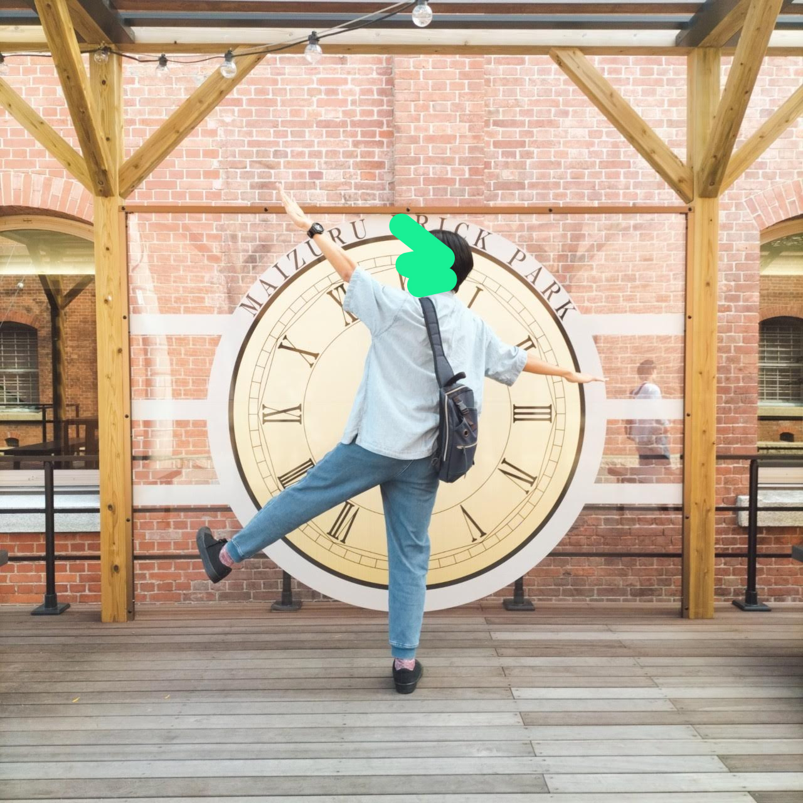

# はじめに
Lorem ipsum dolor sit amet, consectetur adipiscing elit. Sed do eiusmod tempor incididunt ut labore et dolore magna aliqua. Ut enim ad minim veniam, quis nostrud exercitation ullamco laboris nisi ut aliquip ex ea commodo consequat. Duis aute irure dolor in reprehenderit in voluptate velit esse cillum dolore eu fugiat nulla pariatur. Excepteur sint occaecat cupidatat non proident, sunt in culpa qui officia deserunt mollit anim id est laborum.

## Hello World!
「Hello, World!」
こちらはテスト記事です。
これからどんどんブログ記事を追加していくので、お楽しみに！！

## 対応予定の記法一覧
- [x] リンク
- [x] 画像
- [x] リスト
- [x] 番号付きリスト
- [x] チェックリスト
- [x] 引用
- [x] テーブル
- [x] 数式
- [x] インラインコード
- [x] コードブロック
  - [x] シンタックスハイライト
  - [ ] コピーボタン
- [ ] カスタムコンポーネント？


どこまで行けるかな？

### 基本

- 鶏
  - 比内地鶏
  - シャモ
  - 一般
- 豚
  - あぐー豚
  - イベリコ豚
- 牛
  - 近江牛
  - 飛騨牛
  - タスマニアビーフ

1. 一富士
   1. ふじさん
2. 二鷹
   1. たかさん
3. 三茄子
   1. なすび

効いてる→ [Google](https://google.co.jp)はこちら！

効いていない→ google.co.jp はこちら！

続きまして～テーブル
| title      | description                                                                                                     |
| ---------- | --------------------------------------------------------------------------------------------------------------- |
| ズワイガニ | ちゃんと蟹の仲間なので足が10本ある。ちゃんと蟹の仲間なので足が10本ある。ちゃんと蟹の仲間なので足が10本ある。    |
| タラバガニ | ヤドカリの仲間なので足が8本しかない。ヤドカリの仲間なので足が8本しかない。ヤドカリの仲間なので足が8本しかない。 |

長めのテーブルはどうだ...!?

| 顧客ID | 名前       | 年齢 | 性別 | 都道府県 | 職業       | メールアドレス          | 電話番号        | 登録日       | ステータス |
| ------ | ---------- | ---- | ---- | -------- | ---------- | ----------------------- | --------------- | ------------ | ---------- |
| 001    | 佐藤 太郎  | 35   | 男   | 東京都   | エンジニア | taro.sato@example.com   | 090-1234-5678   | 2023-01-15   | 有効       |
| 002    | 鈴木 花子  | 28   | 女   | 神奈川県 | デザイナー | hanako.suzuki@example.com | 080-2345-6789   | 2023-02-20   | 有効       |
| 003    | 高橋 一郎  | 42   | 男   | 大阪府   | 営業       | ichiro.takahashi@example.com | 070-3456-7890   | 2023-03-10   | 有効       |
| 004    | 田中 美咲  | 30   | 女   | 愛知県   | 教師       | misaki.tanaka@example.com | 090-4567-8901   | 2023-04-05   | 有効       |
| 005    | 山本 健二  | 50   | 男   | 北海道   | 医師       | kenji.yamamoto@example.com | 080-5678-9012   | 2023-05-12   | 有効       |
| 006    | 中村 優子  | 27   | 女   | 福岡県   | 看護師     | yuko.nakamura@example.com | 070-6789-0123   | 2023-06-18   | 有効       |
| 007    | 小林 翔太  | 33   | 男   | 京都府   | 公務員     | shota.kobayashi@example.com | 090-7890-1234   | 2023-07-22   | 有効       |
| 008    | 加藤 由美  | 29   | 女   | 静岡県   | 事務員     | yumi.kato@example.com   | 080-8901-2345   | 2023-08-30   | 有効       |
| 009    | 松本 大輔  | 40   | 男   | 広島県   | 弁護士     | daisuke.matsumoto@example.com | 070-9012-3456   | 2023-09-15   | 有効       |
| 010    | 伊藤 彩香  | 25   | 女   | 宮城県   | 学生       | ayaka.ito@example.com   | 090-0123-4567   | 2023-10-01   | 有効       |

> 引用も良い感じ
> > 2重引用も出来るぞ
> > > > 3重引用も出来るぞ
> 1. 数字付きリストだって
> - 箇条書きリストだって
> - [ ] チェックリストだって
> - [x] チェックリストだって
> 
> `コードブロック`だって
> 
> できるぞ

### 画像、ソースコード


メインアイコンのハクセキレイちゃん



これは去年くらいの写真。

## ソースコード・数式などなど
👇 初期のブログレイアウトのソースコード。ファイル名とかコピー機能とか追加していきたいね～

```astro
---
import type { MarkdownLayoutProps } from "astro";
import Layout from "./Layout.astro";

type Props = MarkdownLayoutProps<{
    title: string;
    author: string
    updatedAt: string;
    tag: string[];
}>

const { frontmatter: blog } = Astro.props
---

<Layout title={`${blog} | timtim.tech`}>
    <div class="header">
        <h1>{blog.title}</h1>
        <p>{blog.author}</p>
        <p>{blog.updatedAt}</p>
        <ul>
            {blog.tag.map((tag) => (
                <li>{tag}</li>
            ))}
        </ul>
    </div>
    <div class="contents">
        <slot />
    </div>
</Layout>
```

```typescript
const f = (x: number) => {
	return x * x;
};
```

$2^2=4$は正しいよね。

$$
\int^{\infty}_0 f(x) dx \\
\sin^2 \theta + \cos^2 \theta = 1 \\
\frac{1}{\pi} = \frac{2\sqrt{2}}{99^2}
\sum_{n=0}^\infty
\frac{(4n)!}{(4^n n!)^4}
\frac{1103 + 26390n}{99^{4n}}
$$
