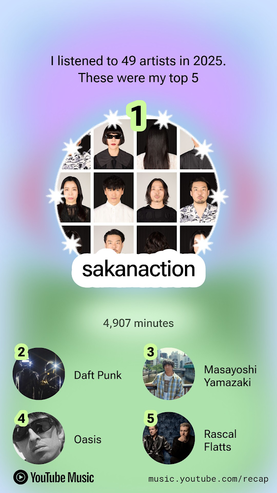
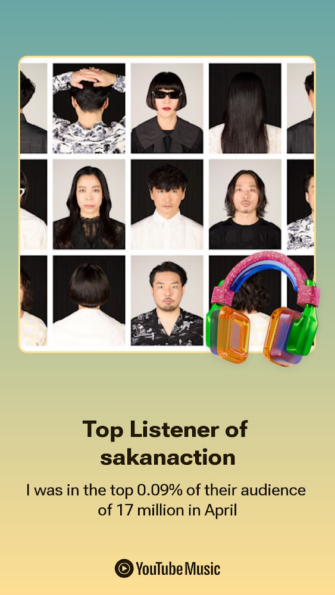
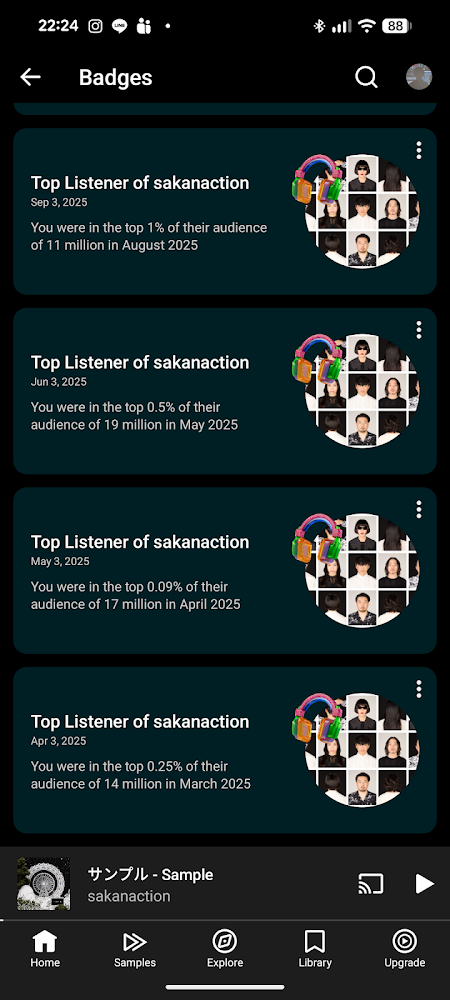

<!-- createdAt: 2025-12-30を追加したい -->
もう今年も終わりか、という実感が無いまま大晦日を迎えている。
年々この実感は薄れていて、弛んでいる自分を正さないと！という意識で少し忙しくなっているのが理由なのか分からないけど。

ただカレンダーや写真のアルバム、友達とのチャットを遡ってみるとなかなかいろいろあった年らしい。
ああ、そうだ。今年は二十歳を迎えて、念願のお酒デビューもしたし、大学編入受験もあった。
本当は毎日日記でも付けて気軽に振り返りたかったものだけど、日記は僕の性格を反映した気まぐれそのものだし怪文書もちらほら...
365日のうちどのくらい書いてたか数えてみてもせいぜい1ヵ月程度。そしてこれを整理する機会は今日くらいしかない。
そこで今年印象に残った出来事を年を越してしまう前に振り返ってみようと思う。
もう新年はそこまで来ている！！ ヤバいよ！！

## 振り返ること
- 大学編入試験について
- 技術的な活動
- 学んだこと
- 読んだ本とか
- （AIやネットで調べる）

## 来年から大学生
気がつけばもう大学生か...
お金がかかるし初めての雪国生活だし

> リンクカード対応したい
> ついでに内部リンクならスマートにしたいぞ
 
詳しくは[2025年度 長岡技術科学大学 編入体験記](./transfer-experience)をご覧くださいませ...

### この期間に支えてくれたもの
- 周りの友達
- 家族
- 顔も知らない先輩の編入体験記
- サカナクション
- 大学生やっている地元の友人
- キラキラの大学生活

## ハマったアーティストや好きな曲
僕は元々あまり音楽を聴く人じゃなかったんだけど、今年はかなりの時間聞いていたみたい。
聞いてた時間は4,907分で、日にち換算でざっとまる3日と10時間ほどだ。
隙間時間や通学時間に聞いていたので全然実感がわかないけど、まさにちりつもだな～と感じている。

今年一番ハマったアーティストはサカナクションだ。
夜に受験勉強をしている時にお気持ち程度にBGMでラジオをよく流していたんだけど、今年のはじめくらいからサカナクションの怪獣が流れていてなんか好きだなーと徐々に惹かれていった。

怪獣も正式にリリースされて「チ」のアニメも見て、気がついたらすっかりサカナクションにハマっていた。
当時は「モス」や「アイデンティティ」、「ミュージック」をヘビロテしていて寮でもガンガン聞いていたら、YouTube Musicから「あなたはサカナクションのトップ0.09%のリスナーです」なんてバッジが送られたりした。

最近よく聞いているのはエンドレス、Ame(A)、セントレイ、M、表参道26時、スローモーションあたり。
好きすぎるあまり家族にも布教していてつい最近兄弟を取り込むことになんとか成功した。

他にはOasisにもハマった。
今年はOasis復活＆来日ツアーとOasisファンにとって激アツな年だったが、あいにく周りが熱狂している時にまだ僕はピンと来ていなかった。

> Oasisについて好きなこととハマったキッカケの友人とのエピソード追加

## 楽しかった思い出
- ため池の活動
- 行った個展
- 学園祭や学校生活

## 技術的な活動や簡単なイベント参加レポ
- 高専セキュコンに参加したよ
  - できる友達におんぶにだっこだったけど
  - （情報漏洩しないように気を付けよう）
- ハッカソン参加記
- ため池のこと（こっちに書くかな）

## 読んだ本・印象に残ったやつとか
- とりまリストに列挙しても良いね
- きっかけ図書のことも書きたいね
- 老人と海についての感想文も
- 読書はいいぞ

