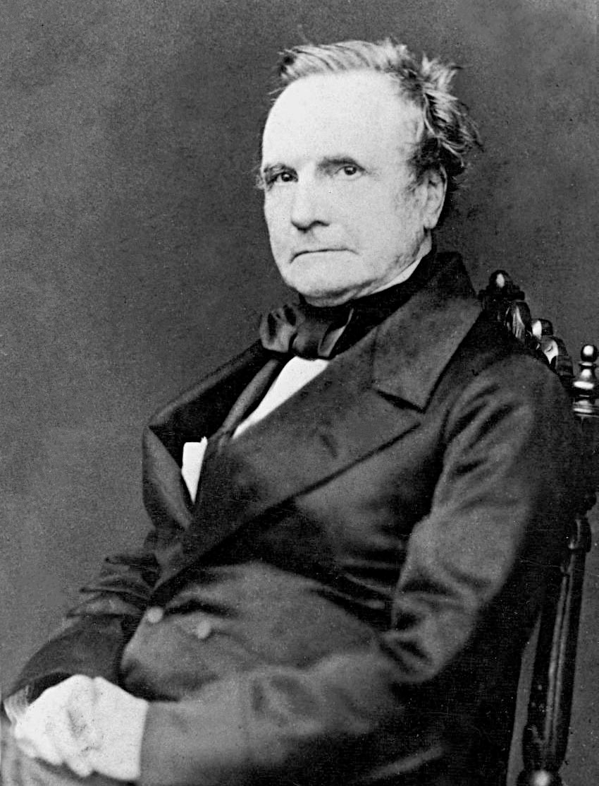

## 最も魅力的な学問

彼は世界で初めてプログラム可能な計算機を考案したコンピュータの父、または最強の暗号と謳われたビジュネル暗号を解読した。

ー かのチャールズ・バベッジは言った。
> **"私に言わせてもらえば、あらゆる学問の中で最も魅力的なのは暗号解読だ。**"

私が暗号を初めて学んだのはつい2年前ほど、高専本科の3年後期だったと記憶しているが、初めての印象は「**難しい数学チックな技術で面白くない**」だった。

シーザー暗号からRSA、公開鍵暗号、共通鍵暗号など一通りを履修したわけだが、この授業以降、暗号技術についてはほとんど触れないまま過ごしてきた。

転機となったのは友人S.Tから見知っていたゆる言語学・コンピュータ化学ラジオを本格的に見始めてからである。

ゆるコンのシリーズに暗号回が計4本の動画であるのだが、**この動画を見て私の暗号に対する印象は θ=π ほど変わった**。

今まで暗号が主に戦争から一般人の個人情報保護までに使われてきたことはスライドの箇条書きで見流していたが、思っていたよりも暗号の重要性についてどんどん気づいていくほどに暗号の面白さにハマっていった。

この4本の動画でおおよそ暗号史の体系は理解した。しかし私の中で唐突に芽吹いた暗号への興味・好奇心はさらなる情報を求めた。

この状態に「待っていました！！」と言わんばかりの書籍が動画で紹介されており、これが本書「暗号解読」であった。

今は読了後なのでよく分かるが、この暗号シリーズの動画の台本や構成の参考で大いに使われているのがこの本である。

おおよその暗号史体系を頭に入れたまま、動画で省略された各暗号の技術詳細や暗号が使用された事例を求めてページを開いた。

## 歴史に人知れず介入してきた暗号

私は極論「**暗号史 ≒ 人類史**」とまで言えると思う。

この本では4章に分けてそれぞれパラダイムシフトとなった暗号技術について書かれている。

主に取り上げられた暗号は、紀元前から

## 暗号解読者は報われない

本書上巻のクライマックス第4章は**"エニグマの解読"**と銘打ってある通り、この世界史を学んだ誰もが一度は耳にする無敵の暗号が如何にして解読され、2度の世界大戦が終結したのかをドラマチックに描いている。

電信の普及と、計算機がこの世に爆誕する直前のご時世なこともあり、手動による暗号化・復号化から、これを容易に行えるタイプライター型の暗号機「エニグマ」が登場し、これにより暗号解読のスケールが指数関数的に爆増した。

これを解読するために英国暗号解読班はブレッチレーパークという施設に多分野から集められた7000人以上の暗号解読者を抱え、このマンパワーで第2次大戦の情報戦を制し、大戦の勝利に大きく貢献した。

このブレッチレーパークお抱えの暗号解読者の中には著名な人物も多く、その中に**コンピュータの父（の一人）と言われる"アラン・チューリング"**もいた。

このアラン・チューリングはエニグマ暗号解読のための機械"ボンブ"の製作に取り組み、最終的にエニグマ暗号解読での立役者となった。

このエニグマ解読による貢献の例として、ある歴史学者は「エニグマ解読が成し遂げられていなければ更に3年も戦争は長引き、多くの人命を失うことになっていた。さらには連合国の勝利も不確かであった」と語るほどだ。

しかし世間がこの第2次大戦情報戦における英雄チューリングの名を知ることになるのはチューリングが亡くなってからのことだった。

実はチューリングは同性愛者であり、重ねて当時の英国社会では同性愛者は**"重大な猥褻行為"**として刑法で罰せられる対象だったのだ。

幸いなことに戦時中はこの事実が露呈することは無かったのだが、終戦後にチューリング本人がこれをうっかり漏らしてしまったことで、チューリングは様々な処置を施された結果、性的不能や肥満など散々な目に遭い、身も心も壊していってしまった。

この戦後の不遇な扱いに耐えかねてチューリングが自殺してしまったところでこの上巻は締めくくられる（不謹慎だがおしゃれに締められている）。

この章に限ったことではないのだが、暗号解読者はあまり報われないように見えた。

それはいくつかの理由があるが、**一番大きいのは機密情報保護による暗号解読従事について厳しく口外が禁じられることだろう**。

そのせいで過去の歴史上で多くの暗号解読者・作成者は発明を政府によって隠され、またこのせいで暗号化・復号化の技術について車輪の再開発が相次いだ。

発明者ならば自身の発明を公表することによって富も名声も得たいのが大半だ。

しかしこれができないことはどれだけ辛かっただろうか... 私なら匿名でも良いのでとにかく発表してしまいたい。

---

### 暗号は多くの人生を狂わせてきた

今まで述べた暗号発明・解読の機密情報保護による苦労は、そもそも前提として暗号の発明や解読に成功または貢献をしてきたモノたちに課される。

暗号史に限らず歴史で見栄えが良い光の部分はおおよそ成功体験だが、暗号解読にも当然闇は存在する。

暗号解読は暗号の種類によるが、基本的に元のメッセージに復号するために暗号化に使われるキーを求める作業、といえる。

このキーを見つけるためにいろいろなパターンを試すが、このパターンが多ければ多いほど、また予測しにくければしにくいほど強力な暗号なのだ。

無秩序に様々な組み合わせを試してみても、たまたま意味のある文章を求められたとしても、全くのでたらめなキーである可能性がほとんどであり、これまでの努力が水泡へと帰すように感じられるだろう。

この本に出てこなくとも、非常に多くの人々が暗号解読という魔に取り憑かれ、多くの時間を費やしたが何も得ず... という悲惨な末路をたどっただろう。

本書ではこの例として**西部開拓時代のアメリカの埋蔵金伝説「ビール暗号」**が取り上げられている。

これを短く説明すると以下のようなものである。

**「"ビール"という人物が黄金の塊をどこかに埋め、書籍暗号を使ってこの座標を記した手紙を残し、これを"ビール文書"という書籍でまとめて広く流布した。これに釣られ暗号解読者と多くのトレジャーハンターが隠された黄金を探し求めた」**

このビール暗号の一件には多くの人々が躍起になって埋蔵金を探し求めた。

ある者は解読された一部の文書を頼りに闇雲に地面に穴をあけていったし、占い師・預言者などを引き連れている者もいたし、埋蔵金が眠っていると思われる土地をまるまる買い占めてしまった者もいた。

しかしこのビールの埋蔵金はついに見つからず、気力を費やした全ての人の時間とお金を奪った。

本書ではこの可哀そうな人代表として、暗号解読に時間を費やした結果、貧乏になり、危うく家族を路頭に迷わせてしまうところだった、**ビール文書の"著者"**が挙げられていた。

このビール暗号は後に暗号技術者界隈で話題となり、これに興味を持った一人であるアメリカの暗号解読者"ウィリアム・フリードマン"大佐は暗号についていかのように考えていた。

> "暗号というものは、うかつな読者を誘惑するような、悪魔的な独創性を持つ。"

このような暗号にハマる危険性を指摘する言葉を目にするたびに、読み進めている私はビクビクしたものだ。

## ヒューマンドラマ盛り沢山の技術史として暗号史はとても面白い

興奮して想定していたよりも文量が嵩んでしまった。

私が暗号解読の読書感想文として伝えたいポイントは、以上である。

1. 暗号史はヒューマンドラマで思いのほか泥臭い
2. 暗号の発展史には"進化"という言葉がぴったりとあてはまる
3. 暗号利用者から見る人間の油断・怠慢
4. 暗号解読の最後の手段は"暴力"

読了まで時間はかかったものの、久々に最後までワクワクしながら楽しめる読書体験ができた。ゆる言語学ラジオの堀本さんがバイブルと評するのも頷けた。

ただ、暗号技術を詳しく理解しようとするとやはり骨が折れたので、ヒューマンドラマに着目するだけでも本書は楽しめるだろう（ただし膨大な量の固有名詞を適当に処理できる適当さがあるのであれば）。

<iframe width="560" height="315" src="https://www.youtube.com/embed/MdEs9oBbc3Q?si=jXVqcXJB6cyshY9j" title="YouTube video player" frameborder="0" allow="accelerometer; autoplay; clipboard-write; encrypted-media; gyroscope; picture-in-picture; web-share" referrerpolicy="strict-origin-when-cross-origin" allowfullscreen></iframe>

本書に突入するのを渋っている方は取り敢えず、**ゆるコンピュータ科学ラジオの暗号シリーズをぜひとも見て欲しい**！

2人の軽快で愉快なやり取りに引き込まれることだろう。

さて、上巻を読み終えただけで読者は暗号を見知った気になってしまいそうだが、嬉しいことにまだ"下巻"がある。

細かい暗号解読テクニックから近代の暗号、未来の暗号"量子暗号"について書かれていそうだ。

その他にも付録や補遺、あとがきが下巻に持っていかれているので、これも是非読もう。

以上が上巻の読書感想文である。また下巻を読んでから読書感想文(下)を描くことにしよう。

> [追記]
>
> 下巻も読んでみたが、これまでの暗号解読のドラマから少し離れて暗号のキッカケとなったであろうヒエログリフやロゼッタストーンから始まっており、正直好みでなかった。
> 内容自体は面白かったので、また体力がある時に挑戦したい。

## 書籍情報

[Amazon.co.jp: 暗号解読（上） (新潮文庫) : サイモン シン, Singh,Simon, 薫, 青木: 本](https://www.amazon.co.jp/%E6%9A%97%E5%8F%B7%E8%A7%A3%E8%AA%AD%E3%80%88%E4%B8%8A%E3%80%89-%E6%96%B0%E6%BD%AE%E6%96%87%E5%BA%AB-%E3%82%B5%E3%82%A4%E3%83%A2%E3%83%B3-%E3%82%B7%E3%83%B3/dp/410215972X)
