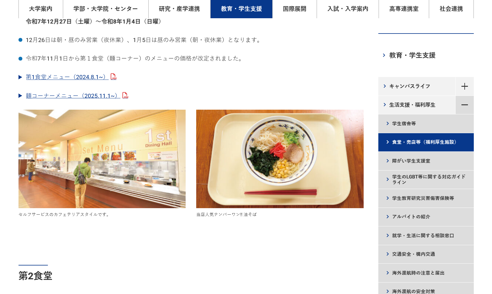

サムネは技科大名物の油そば。
学食のメニューで一番人気らしく、学外から地域の人がわざわざ食べに来るほどだ。

> 学校HPでも「当店人気ナンバーワン!! 油そば」と謡っている

結構おいしかったし、これで500円は安い！美味い！

ちなみに注文レーンを勘違いしていて食べ始めるのが遅くなってしまい、次の受験科目まであんまり時間が無かったので、爆速で啜り込みました。
なのであんまり味は覚えていないです😭

## 来年から大学生になります
現在私は明石高専の5年生であり、実は学校の最高学年だ。
正直この5年間はあっという間だった。
まだまだこの学校にいたいほどに。

5年前の中学3年生の当時はコロナ明けだったのだが、政府の政策でタブレットが配られていた時期でもありこれをキッカケに情報の時間にScratchで作品を作る課題があった。
これにまんまとハマり、学校に高専のチラシが配られていたことや友達が高専を目指していると聞いて、タイピングもままならないまま推薦で取ってもらった結果、僕の手元には明石高専の学生証がある。

高専5年間の振り返りはまた今度しようと思うが、当時から大学編入のことは聞いていたのと、高専1年生の頃に「ドラゴン桜2」が放送されていたこともあって、「俺は東大に行くぞ！！」と一緒に見ていた友達と奮起していた気がする。
今も言っているのか真偽は定かではないが、当時の学校説明会では進学実績を指して「明石は別格！」と息巻いて説明していた。
そんな環境もあって大学編入頑張るぞ、と僕も息巻いていたんだけど、いざ勉強を本格的に始めたのは4年生に上がる前の2月だった。

受験が5年の7月に終わったので、受験勉強は1年とちょっとの期間頑張っていたんだけど、勉強習慣が少しずつ板につくにつれ「もう少し早く始めておけばなあ」と少し後悔していた。

## 受験勉強が楽しかった
正直受験校選びのほうがしんどくて、受験勉強自体は楽しかった。

僕が編入試験のために対策した教科はだいたいこんな感じ
- 数学
	- 解析
	- 線形代数
	- 複素関数
	- 応用数学
	- 統計
- 専門
	- 情報工学
	- 電磁気
- 英語
	- TOEIC
	- 一般
- 国語
	- 現代文
	- 古典

> TODO: もうちょい教科別に対策したこととか深堀出来たら良いな

**だいたい全部の科目が面白かったけど、数学と国語が特に新鮮で面白かった。**

数学は授業でなんとなーくやっていたこともあって、受験で一番対策をしないといけなかった。
なので勉強計画を練っている時は過去の自分を恨んでいたが、未熟だった分勉強の実感が一番得られた。

その中でも一番面白いと思ったのが複素関数論だった。
受験校の変更の影響で、残念ながら試験に活きることは無かったが、数学の力を肌で感じれた良い経験だった。
勉強を重ねるごとにできることが増えていくのが嬉しかったおかげで、絶望的な当初の学力の割にポジティブに受験生活を送れたと思う。

また、国語の勉強は結果的に読書習慣に繋がった。
ちなみに高専の大学編入先は基本的に工学系しか無いので、試験科目に国語を採用している学校は基本的に技科大2つのみで非常に珍しい。
また高専のカリキュラムには文系科目があまり組み込まれておらず、勉強する機会が全然ないので好みに関係なく苦手としている人が多い。
こういう背景もあったので最初は国語対策が憂鬱だったのだが、気持ちから変えようとなにか本を読みに図書館に行ったのが良かった。

今まで技術書やエッセイしか読んでこなかったけど、短い文庫や（邦訳だけど）有名な小説を読んだりしてみて、随筆・物語が好きになった。
これまで読んでいた本の系統は基本的にインプットに偏っていたが、今回読み始めた本達は読者に問いかけてきて考えるようなものが多かった。
国語の現代文では「下線部Xについて登場人物/作者の気持ちを答えよ」みたいな問題が頻出するけど、この経験が少しは役に立ったのかなと思う。

しかしこういう受験に対しても純粋に学問の目線を向けられたのは、比較的自由があって、日頃から専門分野を学んでいる環境があったからだと思う。
中学生の頃は良い高校に行くため、友達と比べて勝負するための偏差値ゲーだった勉強に対して向き合う姿勢を変えられたのは高専の良かったところかも。

すこし脱線したが、受験生活は勉強に対する視点が変わるキッカケになった。
そのおかげでより一層大学生活が楽しみになっている。

## だけどいろいろやらかした
しかしこんな良いことことばかりではなく、とんでもない失敗もしてしまった。

まずは出願の失敗だ。
受験生からしたらありえんミスだろうが、出願締め切りを間違えてしまった。

当時は勉強の波に乗っていて、あまり他のことを考えずに勉強のことだけ考えていたのがまずかった。
出願の準備を始めていた時期にふと要項に目をやると既に出願日程を過ぎていた。
自分の目を疑ったが、いくら見返しても締め切り日はもう過去だった。

幸いだったのが（？）既に出願できている学校もあった。
しかも学力試験まで残り1ヵ月無かったので勉強に身を入れるしかなかった。

ただ1週間くらいは自暴自棄になりそうだった。
自分が悩みぬいた末に選んだ学校だったこと、他に受験校が被っている友達とは受験情報の共有をしていた上で何人か友人が受験していたこともあって、自分自身しんどかったし、周りの友達に変な気を使わせたこともあったと思う。

こんなことになってしまった原因は完璧にカレンダーでスケジュールを管理出来ていなかったことと、盲目的に勉強に取り組んでいたことを言い訳に出願を後回しにしてしまったのが大きいと思う。
正直こんな失敗は2度としたくないので、スケジュールは前倒しに進めていくことを意識している。
こんなことしてしまう人はいないだろうけど、ここぞという踏ん張り時に直撃すると本当に心をやられるので出願は期限の初日にでも出すようにしてほしい。

## 面接で冒険しちゃった
この時点でもうしんどいけど、面接対策はかっちりしたほうが良いことも学んだ。
今回受験した長岡技術科学大学では、初日に学力試験があって翌日に面接がある。

面接官は受験者が出願の際に書いて提出している志望調書を持っている。
この志望調書をベースに面接に応じるのが王道なのだが、私は少し冒険をしてしまった。

というのも志望調書を書いたのが6月頭くらいで面接があったのが6月の末だった。
この期間に将来についてうんうん悩んだり、学校のことをさらに調べていくと、志望動機もすこしずつ変化してくる。
面接で話したいことが少しずつ変わってきてしまうのだ。

事前に編入体験記で面接対策に調べていると、志望調書をベースに質疑応答が行われるので志望調書から逸れたことを言わなければ問題ない、と書いていた。
そこで既に提出済みの志望調書をベースに大きく道を外れない程度に意識して書き換えていたのだが、結果的に完成したものはとても同じ志願者が書いたとは思えない修正版だった。
この様変わりを前にして「流石に志望動機が半分近く変わってる前提で話しても、整合性の点で落とされかねないな。提出したもので面接対策をやり直そうかな」と考えた。
が、本心で面接官を前に熱意を伝えよう！というもう1人の僕が出てきてからはそんな冷静な心は出てこなくなってしまった。

結果、面接当日では緊張のあまりすこし言葉に詰まってしまって、思いだしたくないくらいには思い通りに話すことができなかった。
志望調書と違ったことをどんどん話していく僕を見て面接官の先生も不思議に思ったのだろう。
当初にこやかに始まった面接だったが、徐々に驚きや疑問の表情を浮かべられていた。

試験の出来に自信はあったばかりに面接を終えて帰路の新幹線ではひどく落ち込んでしまった。

しかし7月半ばの合格発表では合格者番号の一覧に自分のものも載っていた。
本当にありがたい。
晴れて僕は大学生になれそうだ。

## 受験生活で得られたこと
だらだら書いてしまったが、僕が言いたいのはこの受験生活は間違いなく自分の糧になったってこと。
- 学問がもっと楽しくなった
- 読書習慣が付いた
- 失敗しつつもスケジュール管理能力がついた
- 精神力が鍛えられた

ほかの受験生や友達も言っているんだろうけど、編入試験は予備校に通うことも基本なく、ネットや学校の資料室に転がっているわずかな情報に感謝しながら勉強スケジュールを自分で管理しなければならない。
一般の大学受験に比べて受験科目が少ない傾向にあることや、時期が違うこともあって単純比較はできないけど、合否結果が自己管理により委ねられている気がする。

この受験生活を乗り切った経験は間違いなく自分の成長に繋がっていると感じている。
この生活を支えてくれた友達と家族、そして後輩のために体験記や対策など情報を残してくださった先輩らに感謝申し上げたい。

まだ受けられるか分からないが院進の際も同じように自分との戦いになるのだろうけれど、この編入を乗り切った経験を励みに頑張りたい。
