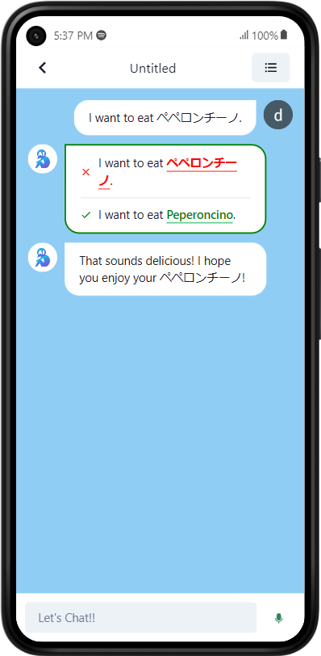
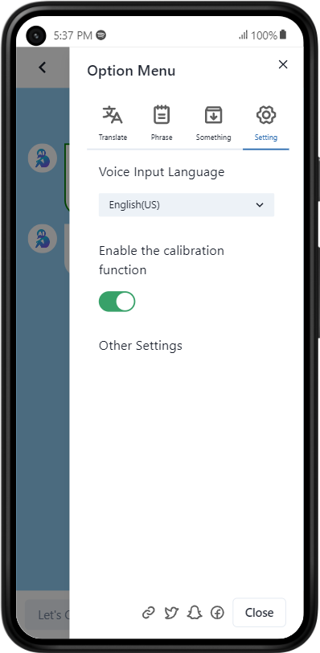

## 概要
2023年12月にタイ王国のルーイで開催された、TJ-SSF 2023(日タイ高校生サイエンスフェア)にて、研究発表のために制作したプロダクトです。

英会話教室やオンライン英会話とは違い、人ではなくAIと英会話ができるチャットアプリです。
弊校学生を対象にこのアプリで英会話をしてもらい、通常の英会話との学習効果の違いについて調べ、発表しました。
今までで1番頑張った開発です。

### できること
主要な機能としては以下があります。
- 様々なモードでの英会話
- メッセージの校正
- 英語以外にも多言語での会話

技術欄にもありますが、このアプリはChatGPTで使用されている、OpenAI APIを使用しています。
私たちが送信したメッセージに対して適切な文章を返答してくれます。

複数のチャットモードが用意されており、それぞれ __ディスカッション__、__ロールプレイング__、__フリートーク__ を楽しめます。

また、__メッセージ校正機能__ は優れものです。スペルミスの修正や、より適切な文章の提案をしてくれます。
また、__分からない単語を一旦母国語に置き替えて、校正メッセージで翻訳してもらうテクニック__ があります。

### ターゲット
__アプリ名の”ぼっち”トークから分かるように人間の会話相手が不要です。__ そのため以下のような方々におすすめです。
- コミュ障
- 相手に気遣いしすぎて疲れてしまう人
- その他いろいろな理由で会話相手を確保できない人

まずはコミュ障だと自覚している人です。人間が相手だと、相手とペースを合わせる必要があります。また共通な話題があるとは限らず、__テンポよく会話するまでに時間がかかると思います。__

次に気遣いで疲れてしまう人です。人間と話している以上は相手の機嫌を損ねないように、言葉遣いや表情、会話の間を意識する必要があります。これらの努力によって円滑にコミュニケーションを進めることが出来ます。しかし、英会話においてはこの気遣いがハードルになります。
ただでさえ英語に慣れていないのに、__これら気遣いの意識は言語学習を始めることの妨げになり得ます。__

このように十人十色な人間だからこそ生じる、コミュニケーションの壁があります。この問題は、ユーザーの好みにカスタムできる、AIを使うことで解決できます。
AIが相手であれば、会話を考える時間や、相手への気遣いといった __”ストレス”を除いて、言語学習に集中できます。__

対AIのアプリであるため、__忙しい人でも時間や場所を問わず、英会話を続けられます。__

### デモ
以下のようにモードを選択してからチャットを開始します。

校正モードをオンにすることで、スペルミスの修正や、適切な単語の提案を行ってくれる優れものです。

## 取り組み
### UXの配慮
Next.jsのPage Routerを使用した開発であったため、__画面遷移時のUX(User Experience)を一番重要視しました。__
例えば、ログイン時の画面遷移にて、ユーザーのログイン状態を判断してから遷移していては一瞬、待機画面が表示されてしまっていました。この画面のチラつきはユーザー体験を損ないます。

この問題を解決するため、事前にログイン状態を確認してからページを表示するべく、SSR(Server Side Rendering)で実装しました。このSSRに対応するために、ユーザーの認証管理をFirebase AuthからNextAuth.jsに移行しました。

また、チャットを一覧できるダッシュボード画面では、チャットデータをFirestoreから取得している際には、スケルトンUIを表示して、ユーザーを不安に思わせないように考えました。

### OpenAI APIのパフォーマンス向上
次に、OpenAI APIについて取り組んだことは主に2つです。
1. プロンプトの工夫
2. レスポンス速度のチューニング

このアプリでは応答メッセージ、校正機能、高機能な翻訳にOpenAI APIを使用しています。
単純なプロンプトでは投げたメッセージとの雰囲気にズレが生じたり、言語が一致しなかったです。そのため、メッセージ例をプロンプトに組み込むことでこれらの精度を上げました。

また、レスポンス速度を上げるために、メッセージ応答・校正を並列で処理するなど工夫しました。

### 実際の業務を意識したGitHubの運用
また、友人と2人で開発したため、NotionやGitHub Projectを使ってプロジェクト管理を行いました。またテンプレートを利用して後から見返しても分かりやすいようにIssue, PRを作成しました。実際にユーザに使ってもらうことも想定してリリース管理も行いました。
